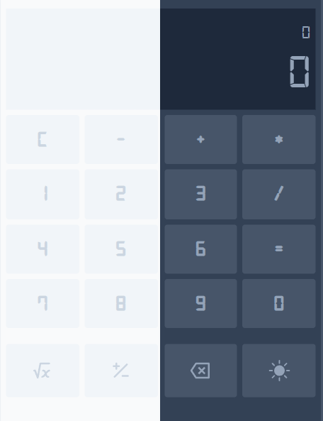

<p align="center">
  <a href="" rel="noopener">
 </a>
</p>

<h2 align="center">Extendable-Calc</h2>

<div align="center">

[]()

[](https://github.com/kylelobo/The-Documentation-Compendium/pulls)
[](/LICENSE)

</div>

---

# 🧮  Calc app that can be extanded.


## 📝 Table of Contents

- [About](#about)
- [Getting Started](#getting_started)
- [Deployment](#deployment)
- [Usage](#usage)
- [Built Using](#built_using)
- [TODO](../TODO.md)
- [Contributing](../CONTRIBUTING.md)
- [Authors](#authors)
- [Acknowledgments](#acknowledgement)

## ❔ About <a name = "about"></a>

<b style='color:#333'>Simple React Calculator Project</b>

---

## 🏁 Getting Started <a name = "getting_started"></a>

These instructions will get you a copy of the project up and running on your local machine for development and testing purposes. See [deployment](#deployment) for notes on how to deploy the project on a live system.

---

### Prerequisites

For using this app you should have installed on your local machine

```
NodeJS
NPM or Yarn
```

---

### Installing

You can install this app only by cloning this REPO. <b>NPM package of this REPO</b> is <b style='color:red;text-transform:uppercase'>Not Available</b>.

---

Start from cloning

```
git clone https://github.com/aliskhanoff/extendable-calc.git .
```

Install packages with NPM

```
npm install
```

or Yarn

```
yarn install
```

Then start the app

```
yarn start | npm run start
```

---

## 🔧 Running the tests <a name = "tests"></a>

Tests of the project written using Jest 

```
yarn test
```

or

```
npm run test
```


### Break down into end to end tests

Explain what these tests test and why

```
Give an example
```

### And coding style tests

Explain what these tests test and why

```
Give an example
```

---

## 🎈 Usage <a name="usage"></a>

Start and run

## 🚀 Deployment <a name = "deployment"></a>

Add additional notes about how to deploy this on a live system.

## ⛏️ Built Using <a name = "built_using"></a>

- [NodeJS](https://www.nodejs.com/) - Building tool
- [Tailwind CSS](https://tailwindcss.com/) - Headless CSS Framework
- [React](https://react.dev) - Most popular Frontend Framework
- [Jest](https://jestjs.io) - Testing tool

## ✍️ Authors <a name = "authors"></a>

- [@aliskhanoff](https://github.com/kylelobo) - Idea & Builder

See also the list of [contributors](https://github.com/kylelobo/The-Documentation-Compendium/contributors) who participated in this project.

## 🎉 Acknowledgements <a name = "acknowledgement"></a>

- Nobody else perticipates this project